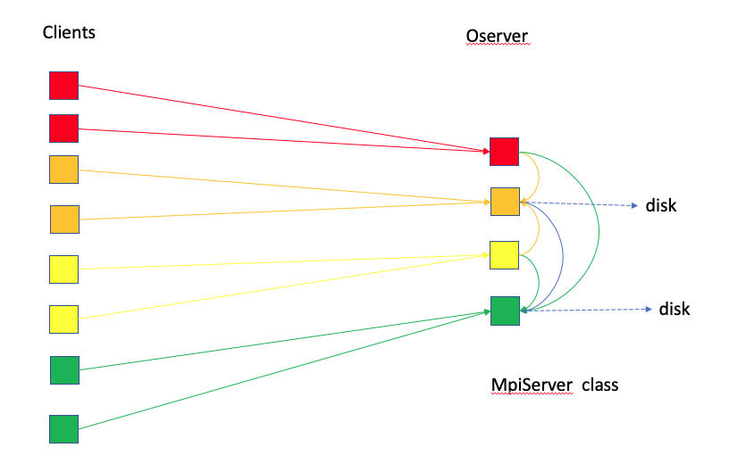
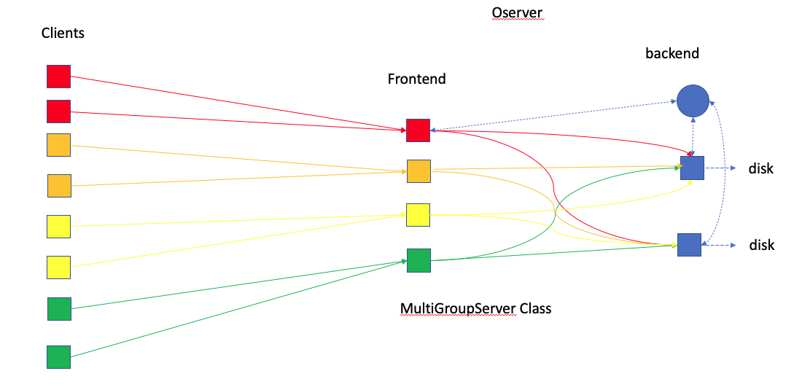
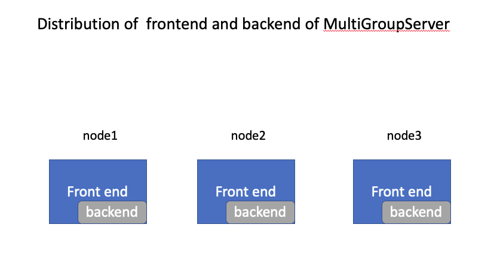
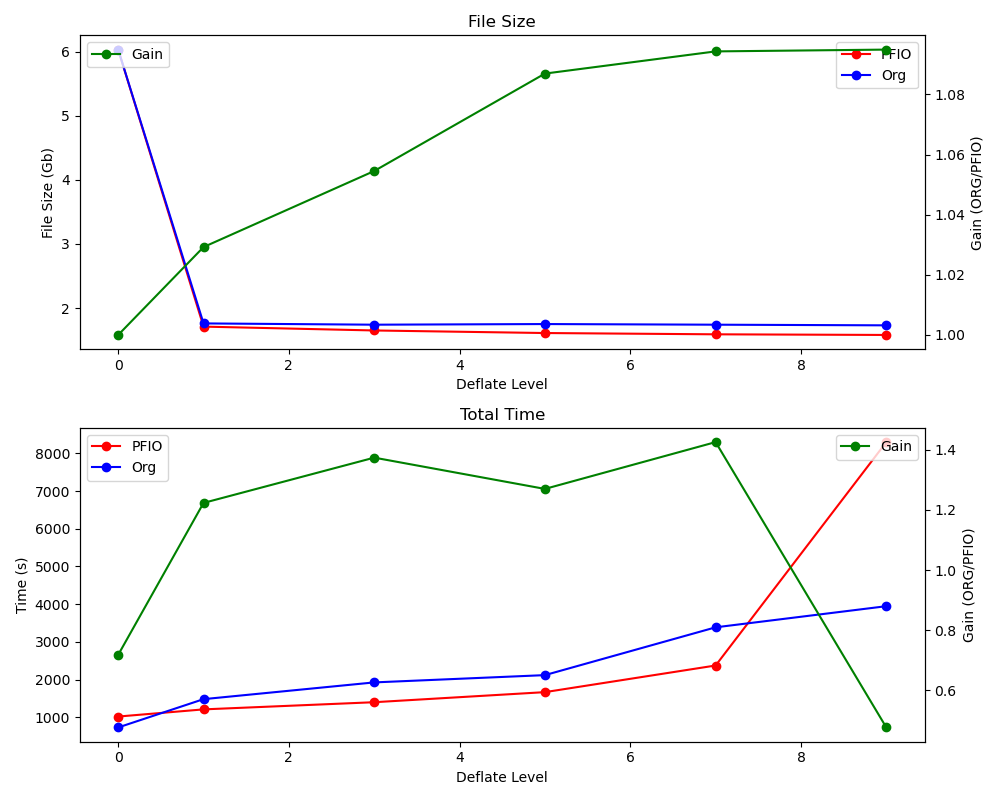

# Basic Instructions for Using PFIO

**MpiServer Class**
- The clients sends the data to `Oserver`.
- All processors in `Oserver` would coordinate to create different shared memory windows for different collections.
- The processors use one-sided `MPI_PUT` to send the data to the shared memory.
- Different collections are written by different processors. Those writing processors are distributed among nodes as eveny as possible.
- All the other processors have to wait for the wrting processors to  finish jobs before responding to Clients’ next round of requests.

**MultiGroupServer Class**
- The oserver is devided into frontend and backend.
- When the frontend receive the data,  its root process asks backend‘s root (or head) for an idle process for each collection. Then it broadcasts the info to the other frontend processes.
- When the frontend processors  forward (`MPI_SEND`)  the data to the backend ( different collections to different backend processors), they get back the the clients without waiting for the actual writing.

## Command Line

There are two options to submit an executable through the `mpi_run` or `mpi_exec` command.

### Regular MPI Command
If the regular `mpi_run` or `mpi_exec` command is used:

    mpi_run -np npes ExeccuTable

the `MpiServer` is used as `oserver`.
The `client` processes are overlapping with `oserver` processes.
The `client` and `oserver` are sequetically working together.
When ``client`` sends data, it actually makes a copy, then the `oserver` takes over the work,
i.e., shuffling data and writing data to the disk. After `MpiServer` is done, the `client` moves on.

### Command with IOserver Options
#### `n1` processes for the model and `n2` processes for the `MpiServer`

    mpi_run -np npes ExeccuTable –npes_model n1  --npes_output_server n2

- Note that `npes` is not equal to `n1+n2`.
- The `client` (model) will use the minimum number of nodes that contain `n1` cores. For example, if each node has `n` processors, the `npes = ceiling(n1/n)*n + n2`.
- If  `--isolate_nodes` is set to false ( by default, it is true), the `oserver` and `client` can co-exist in the same node, and `npes = n1 + n2`.
- `--npes_output_server n2` can be replaced by  `--nodes_output_server n2`. Then the `npes = ceiling(n1/n)*n + n2*n`.

#### `n1` processes for the model and `n2` processes for the `MultiGroupServer` 

    mpi_run -np npes ExeccuTable –npes_model n1 --npes_output_server n2 --oserver_type multigroup --npes_backend_pernode n3

- For each node of oserver, `n3` processes are used as backend.
- For example, if each node has `n` cores, then `npes = ceiling(n1/n)*n + n2*n`.
- The frontend has `n2*(n-n3)` processes and the backend has `n3*n` processes.
- The frontend has `ceiling(n2/n)*(n-n3)` processes and the backend has `n3*n` processes.

#### Passing a vector of `oservers`

    mpi_run -np npes ExeccuTable –npes_model n1  --npes_output_server n2 n3 n4

- The command creates `n2`-node, `n3`-nodes and `n4`-nodes `MpiServer`.
- The `oservers` are independent. The client would take turns to send data to different `oservers`.
- If each node has `n` processors, then `npes = ceiling(n1/n)*n + (n2+n3+n4)*n`.
- **Advantage**: Since the `oservers` are independent, the `client` has choice to send data to idle `oserver`.
- **Disavantage**: Finding an idle `oserver` is not easy.

#### Passing a vector of `oservers` and the `MultiGroupServer`

    mpi_run -np npes ExeccuTable –npes_model n1  --npes_output_server n2 n3 n4 --oserver_type multigroup --npes_backend_pernode n5

- The command creates `n2`-node, `n3`-nodes and `n4`-nodes `MultiGroupServer`.
- The `oservers` are independent. The `client` would take turns to send data to different `oservers`.
- If each node has `n` processors, then `npes = ceiling(n1/n)*n + (n2+n3+n4)*n`.
- Each `oserver` has `n2*n5`, `n3*n5`, and `n4*n5` backend processes respectively.

#### `MpiServer` using one-sided `MPI_PUT` and shared memory

   mpi_run -np npes ExeccuTable –npes_model n1 --npes_output_server n2 --one_node_output true

- The option `--one_node_output true` makes it easy to create `n2` oservers and each is one-node oserver.
- It is equivalent to `--nodes_output_server 1 1 1 1 1 ...` with `n2` “1”s.

#### Additional Options

`--fast_oclient true`

- After the client sends history data to the oserver, by default it waits and makes sure all the data is sent even it uses non-blocking isend. If this option is set to true, the client copies the data before non-blocking isend. It waits and cleans up the copies next time when it re-uses the oserver.

## Example

The file `pfio_MAPL_demo.F90` is a standalone program that implement the use of PFIO.
It writes several time records of 2D and 3D arrays.
The compilation of the program generates the executable, `pfio_MAPL_demo.x`.
If we reserve 2 `haswell` nodes (28 cores in each), want to run the model on 28 cores and use 1 `MultiGroup` with 5 backend processes, then the execution command is:

    mpiexec -np 56 pfio_MAPL_demo.x --npes_model 28 --oserver_type multigroup --nodes_output_server 1 --npes_backend_pernode 5

- The frontend has `28-5=23` processes and the backend has `5` processes.

### Performance Analysis
We create a collection that contains:
- one 2D variable (`IMxJM`)
- one 3D variable (`IMxJMxKM`)

Three (3) 'daily' files are written out and each of them contains six (6) time records. 
We measure the time to perform the IO operations.
Note that no calculations are involved here. We only do the array initialization.

PFIO has a profiling tool which is exercised by passing the command line option: `--with_io_profiler true`

    mpiexec -np 56 $MAPLBIN/pfio_MAPL_demo.x --npes_model 28 --oserver_type multigroup --nodes_output_server 1 --npes_backend_pernode 5 --with_io_profiler true

It returns the following timing statistics:

- **Inclusive**:  all time spent between start and stop of a given timer.
- **Exclusive**:  all time spent between start and stop of a given timer \_except\_ time spent in any other timers.
- `o_server_front`: 
- `--wait_message`:  Time while the front ends is waiting for the data from application. 
- `--add_Histcollection`: Time for adding history collections.  
- `--receive_data`:  The total time Frontends receive data from applications.
- `----collection_1`:  The time Frontends receive collection_1.
-  `--forward_data`:  The total time Frontends forward data to Backend.
- `----collection_1`:  The time Frontends forward collection_1.
- `--clean up`:  The time finalizing o-server.

`IM=360 JM=181 KM=72` 

with 5 Backend PEs/node

        =============
        Name                 Inclusive % Incl Exclusive % Excl Max Excl  Min Excl  Max PE Min PE
        i_server_client       0.324201 100.00  0.324201 100.00  0.520954  0.245613  0016   0023

        Final profile
        =============
        Name                 Inclusive % Incl Exclusive % Excl Max Excl  Min Excl  Max PE Min PE
        o_server_front        0.357244 100.00  0.053738  15.04  0.881602  0.013470  0000   0002
        --wait_message        0.047207  13.21  0.047207  13.21  0.052244  0.040038  0011   0013
        --add_Histcollection  0.003346   0.94  0.003346   0.94  0.005641  0.000294  0002   0007
        --receive_data        0.194778  54.52  0.000496   0.14  0.000696  0.000367  0013   0019
        ----collection_1      0.194282  54.38  0.194282  54.38  0.421234  0.113870  0013   0021
        --forward_data        0.057849  16.19  0.017939   5.02  0.051281  0.000058  0020   0018
        ----collection_1      0.039910  11.17  0.039910  11.17  0.048129  0.030721  0018   0019
        --clean up            0.000325   0.09  0.000325   0.09  0.000529  0.000244  0009   0017
        
 In the table below, we report the **Inclusive** time for the two main IO components as the number of backend PEs per node varies:
 
  | Number of Backend PEs/node | i_server_client | o_server_front  |
 |  ---:  | ---  | ---  |
 | 1 |     |     |
 | 2 |  1.186932   |  1.813097   |
 | 3 |  0.291334   |  1.216281   |
 | 4 |  0.259511   |  0.296956   |
 | 5 |  0.324201   |  0.357244   |

`IM=720 JM=361 KM=72` 

with 5 Backend PEs/node

        =============
        Name                 Inclusive % Incl Exclusive % Excl Max Excl  Min Excl  Max PE Min PE
        i_server_client       1.050624 100.00  1.050624 100.00  1.515223  0.822786  0015   0025

        Final profile
        =============
        Name                 Inclusive % Incl Exclusive % Excl Max Excl  Min Excl  Max PE Min PE
        o_server_front        1.250806 100.00  0.128693  10.29  2.737311  0.008478  0000   0012
        --wait_message        0.108261   8.66  0.108261   8.66  0.130712  0.081595  0008   0022
        --add_Histcollection  0.003061   0.24  0.003061   0.24  0.004589  0.001020  0004   0002
        --receive_data        0.789012  63.08  0.000642   0.05  0.000909  0.000484  0013   0019
        ----collection_1      0.788370  63.03  0.788370  63.03  1.568300  0.406615  0013   0021
        --forward_data        0.221412  17.70  0.102570   8.20  0.378546  0.000081  0021   0018
        ----collection_1      0.118842   9.50  0.118842   9.50  0.145169  0.090811  0013   0021
        --clean up            0.000367   0.03  0.000367   0.03  0.000552  0.000256  0004   0012
        

 In the table below, we report the **Inclusive** time for the two main IO components as the number of backend PEs per node varies:
 
 | Number of Backend PEs/node | i_server_client | o_server_front  |
 |  ---:  | ---  | ---  |
 | 1 |     |     |
 | 2 |  3.378511   | 5.795466    |
 | 3 |  0.977153   | 6.262224    |
 | 4 |  1.009190   | 1.203735    |
 | 5 |  1.050624   | 1.250806    |
 

# Implementation of PFIO in LIS

## Test Case

### Model Configuration

- 5901x2801 grid points
- one-day integration with output produced every 3 hours (8 files with one record each)
- The fields to be written out are:
    - 80 2D fields
    - 4 3D fields (with 4 levels)

Without any data compression, each output file produced here requires 6.43 Gb.
Our goal here is not only to reduce the time spent on IO but also to decrease
the file size by applying data compression.

### Results

We ran the orgininal version of the LIS code (ORG) and the one with the PFIO implementation (PFIO).
As the datacompression level varies, we recorded the average output file size (out of 8 files)
and the total time to complete the integration.

| Deflation Level  | Average File Size | . | Total Time (s) | . |
|--- | ---| --- | --- | --- |
| | **ORG** | **PFIO** | **ORG** | **PFIO** |
| 0 | 6.03 | 6.03 | 734 | 1023 |
| 1 | 1.76 | 1.71 | 1484 | 1213 |
| 3 | 1.74 | 1.65 | 1928 | 1403 |
| 5 | 1.75 | 1.61 | 2121 | 1670 |
| 7 | 1.74 | 1.59 | 3388 | 2376 |
| 9 | 1.73 | 1.58 | 3948 | 8297 |

#### Comments

From the above statistics, we can make the following comments:

- Using the deflation level 1 is most cost effective in both ORG and PFIO.
    - At such level, PFIO runs faster tends to generate a smaller file size.
- At deflation level 9, the time to collect the data and do data compression appears to be higher than the model computing time. PFIO performs very poorly.
- PFIO works better when the model computations require more time than the communications between the computing cores and the IO servers.
- As we increase the model resolution and produce the data less often (say every 12 hours for instance), we expect PFIO to perform better.
